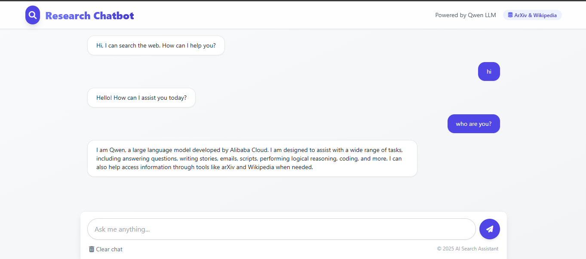
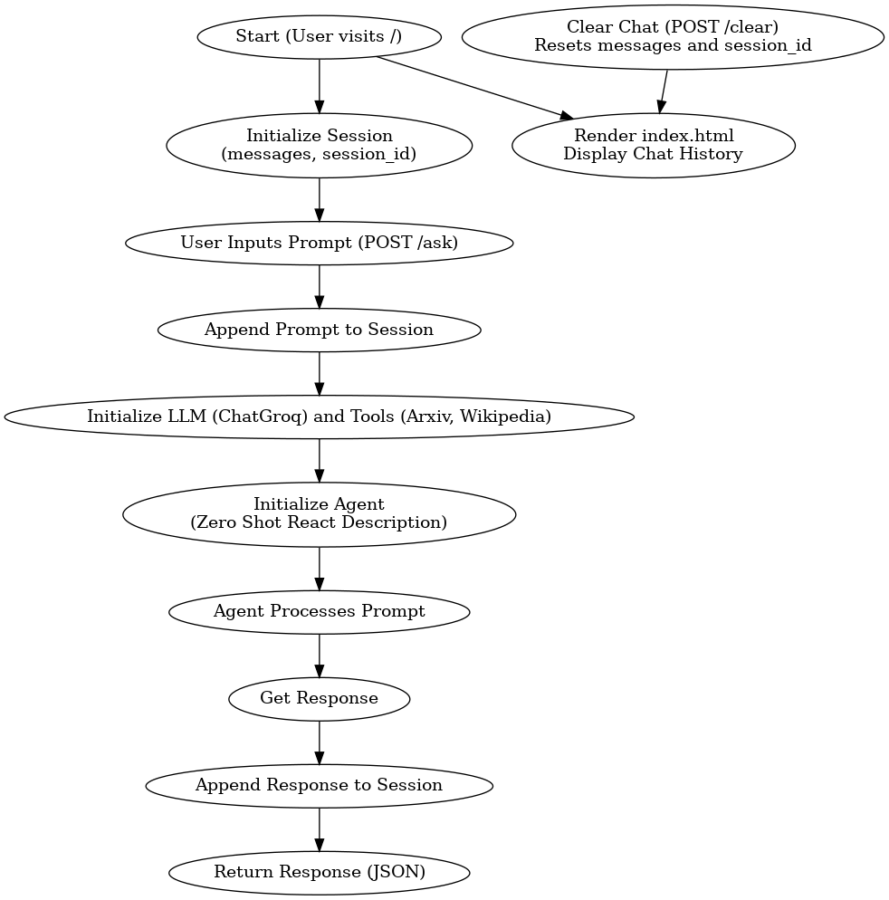

# AI Search Assistant

## Project Overview
This AI Search Assistant is a web-based application that leverages Qwen-32B language processing capabilities to provide intelligent search results from academic and encyclopedia sources. The application combines a modern, responsive UI with powerful backend search functionality to create an intuitive chat-based search experience.



## Features

### Search Capabilities
- **Multi-source Search**: Integrates with both ArXiv and Wikipedia APIs to provide comprehensive search results
- **Intelligent Query Processing**: Uses Groq's Qwen-32B model to understand and process natural language queries


### User Interface
- **Modern Chat Interface**: Clean, intuitive chat-based UI with user and assistant message bubbles
- **Responsive Design**: Fully responsive layout that works on desktop and mobile devices
- **Real-time Feedback**: Visual loading indicators show when searches are in progress
- **Session Management**: Maintains chat history within the session for contextual conversations
- **Glass Effect Navbar**: Modern transparent navbar with blur effect for a premium look

## Technology Stack

### Frontend
- **HTML/CSS**: Semantic markup with modern CSS features
- **Tailwind CSS**: Utility-first CSS framework for responsive design
- **JavaScript/jQuery**: Client-side interactivity and AJAX requests
- **Font Awesome**: Icon library for UI elements

### Backend
- **Python**: Core backend language
- **Flask**: Web framework for handling routes and sessions
- **LangChain**: Framework for connecting language models to external data sources
- **Groq**: API for accessing large language models (Qwen-QWQ-32B)
- **ArXiv API**: Access to academic papers and research
- **Wikipedia API**: Access to encyclopedia knowledge

## Architecture



### Client-Server Communication
1. User inputs a query in the chat interface
2. Query is sent to Flask backend via AJAX
3. Backend processes the query through the LLM and search tools
4. Response is returned to the client and displayed in the chat

### Search Process Flow
1. Query is received by the Flask backend
2. LangChain agent evaluates the best search strategy
3. Search is executed against ArXiv and Wikipedia APIs
4. Results are processed and formatted by the LLM
5. Formatted response is returned to the user

## Installation and Setup

### Prerequisites
- Python 3.9+
- Groq API key

### Installation Steps
1. Clone the repository
2. Create a virtual environment: `python -m venv env`
3. Activate the virtual environment:
   - Windows: `env\Scripts\activate`
   - Unix/MacOS: `source env/bin/activate`
4. Install dependencies: `pip install -r requirements.txt`
5. Create a `.env` file with your Groq API key: `GROQ_API_KEY=your_api_key_here`

### Running the Application
1. Start the Flask server: `python app.py`
2. Access the application at `http://localhost:5000`

## Project Structure
```
Research Agent/
├── app.py                # Main Flask application file
├── templates/            # Frontend templates
│   └── index.html        # Main UI template
├── requirements.txt      # Python dependencies
├── .env                  # Environment variables (not in repo)
└── .gitignore            # Git ignore file
```

## Security Considerations
- API keys are stored in environment variables, not in the code
- User sessions are managed securely with Flask's session mechanism
- Input validation is performed before processing queries
---

© 2025 AI Search Assistant
